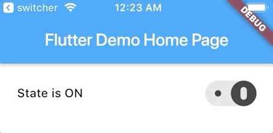

# dark_floating_switcher

**dark_floating_switcher** widget for Flutter project.



## Getting Started

For use **dark_floating_switcher** widget in your project:
1. Add dependency in the **pubspec.yaml** file
```dart
    dependencies:
        flutter:
            sdk: flutter
        dark_floating_switcher:
            git:
                url: git@github.com:shekunsky/FLUTTER-dark_floating_switcher.git
```

2. Import widget in the dart file:
```dart
    import 'package:dark_floating_switcher/dark_floating_switcher.dart';
    import 'package:dark_floating_switcher/dark_floating_switcher_state.dart';
```

3. Make an instance of the widget.

    ```dart
         DarkFloatingSwitcher(
                state: DarkFloatingSwitcherState.on,
                valueChanged: (state) {
                  if (state == DarkFloatingSwitcherState.on) {
                    print('State is ON');
                  } else {
                    print('State is OFF');
                  }
                },
              )
    ```
    
    
    ## License

    Windmill Smart Solutions 2020 ©